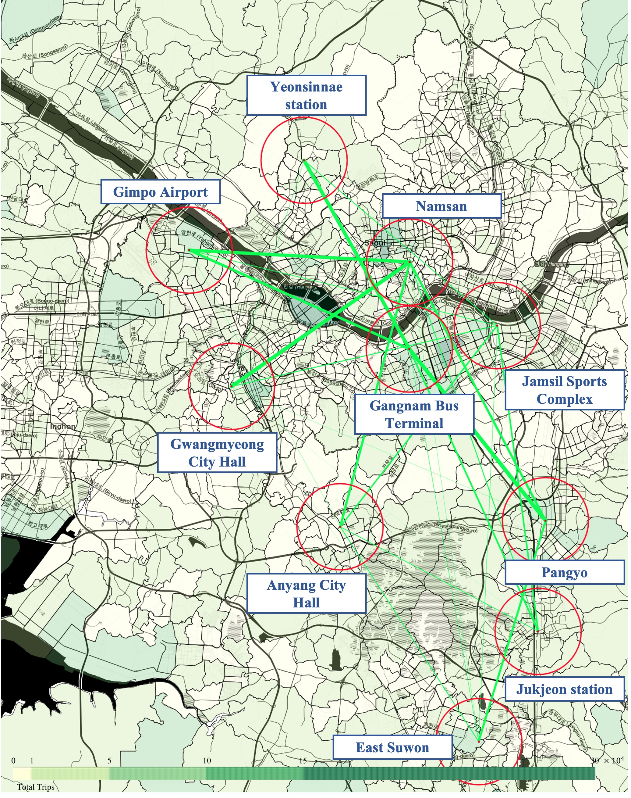
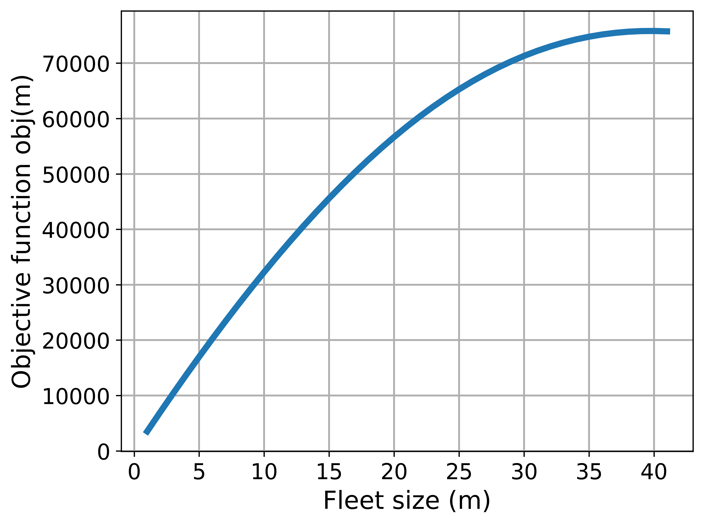
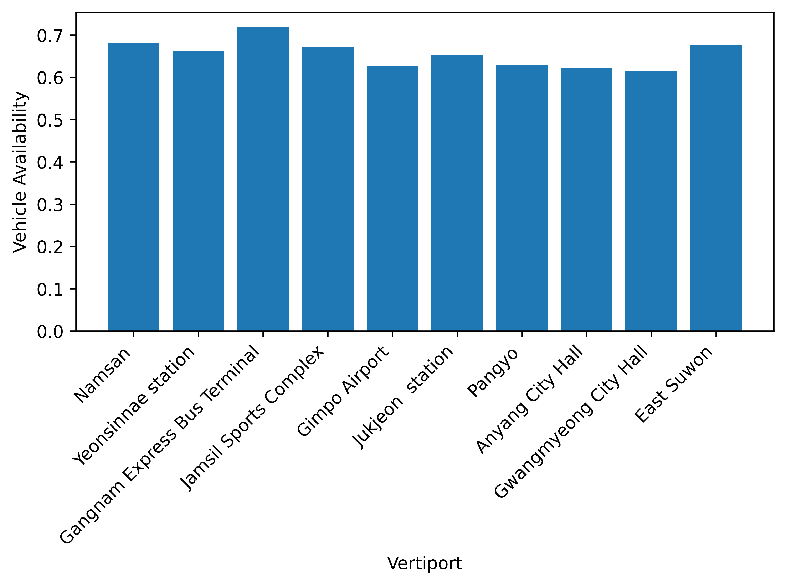
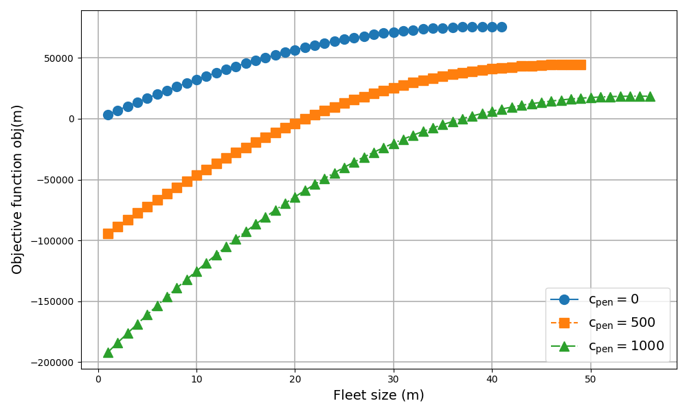

# Optimal Fleet Sizing for On-demand Urban Air Mobility Services 

This repository provides the experimental code and data for reproducing the results of the 2025 IEEE International Conference on Intelligent Transportation Systems (ITSC 2025) paper:

**"Optimal Fleet Sizing for On-demand Urban Air Mobility Services using Queueing-Theoretical Approach"**  
*Byeong Tak Park, KT Corporation*

## Overview

Urban Air Mobility (UAM) offers a promising solution to urban traffic congestion by enabling on-demand air-based transportation. However, the stochastic nature of passenger demand introduces significant challenges in maintaining high service availability—especially vehicle availability at vertiports.

This project develops a closed Jackson network model with passenger loss to capture the dynamics of an on-demand UAM system. We formulate a **profit-maximization problem** that determines the **optimal fleet size** while satisfying a minimum service availability threshold. The model explicitly accounts for demand uncertainty and considers both **proactive fleet provisioning** and **reactive passenger compensation** strategies.

An iterative exact solution search algorithm is implemented to identify:
- The **minimum fleet size** required to meet availability targets
- The **optimal fleet size** that maximizes profit under various compensation scenarios

The model is validated through a Seoul City case study. Results show that:
- A fleet of 40 vehicles maximizes profit under baseline assumptions
- Incorporating moderate to high compensation schemes increases the optimal fleet size (to 48 and 55 vehicles, respectively) but reduces profitability

This framework provides actionable insights for UAM fleet operators and urban mobility planners making data-driven decisions on scalable UAM deployment.


## A case study of Seoul metropolitan area, Republic of Korea

The simulation and analysis are based on a case study of Seoul metropolitan area, Republic of Korea, presented in [**Optimal Vertiport Locations for Air Taxi Services in Metropolitan Areas**](https://link.springer.com/article/10.1007/s42405-024-00807-4) (*Kim, S. H., Park, B. T., Chae, M., Shim, S., & Kim, H., 2025*).
The figure below illustrates the candidate vertiport locations used in the study consisting of:
- Namsan
- Gimpo Airport
- Yeonsinnae Station
- Gangnam Bus Terminal
- Jamsil Sport Complex
- Gwangmyeong City Hall
- Anyang City Hall
- East Suwon
- Jukjeon Station
- Pangyo Station



Results show that: 
- A fleet of 40 vehicles maximizes profit under baseline assumption.
   
- At the optimal fleet size, all vertiports achieved a minimum service availability level between 0.62 and 0.72.
  
- Incorporating compensation schemes increases the optimal fleet sizes but reduces profitability
  


---
## Citation
```bibtex
@inproceedings{park2025uam,
  author    = {Byeong Tak Park},
  title     = {Optimal Fleet Sizing for On-demand Urban Air Mobility Services using Queueing-Theoretical Approach},
  booktitle = {Proc. 28th IEEE International Conference on Intelligent Transportation Systems (ITSC)},
  year      = {2025},
}
